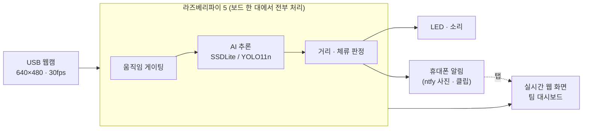
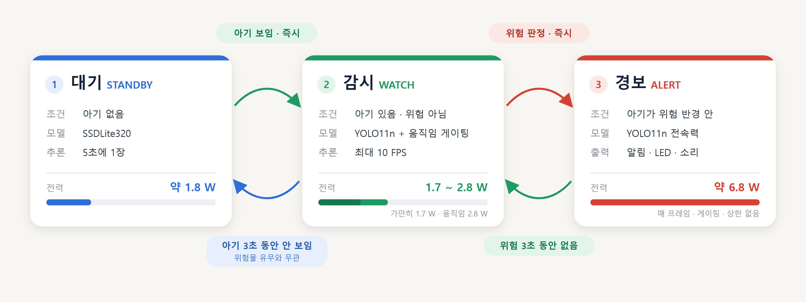
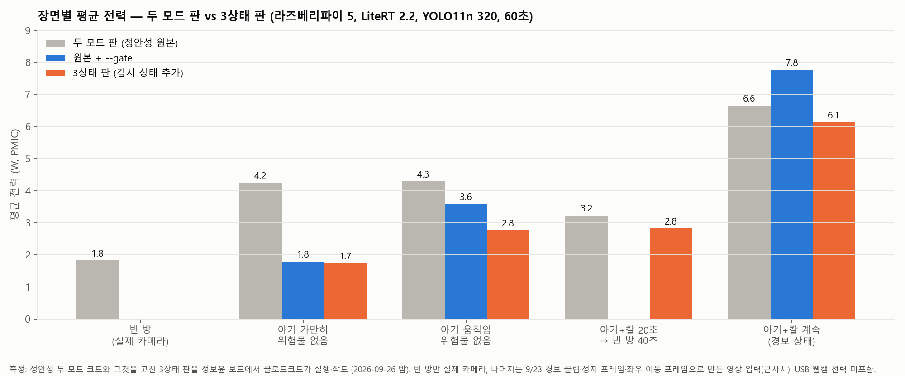
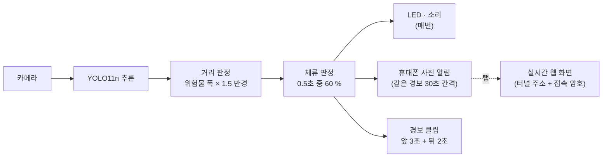
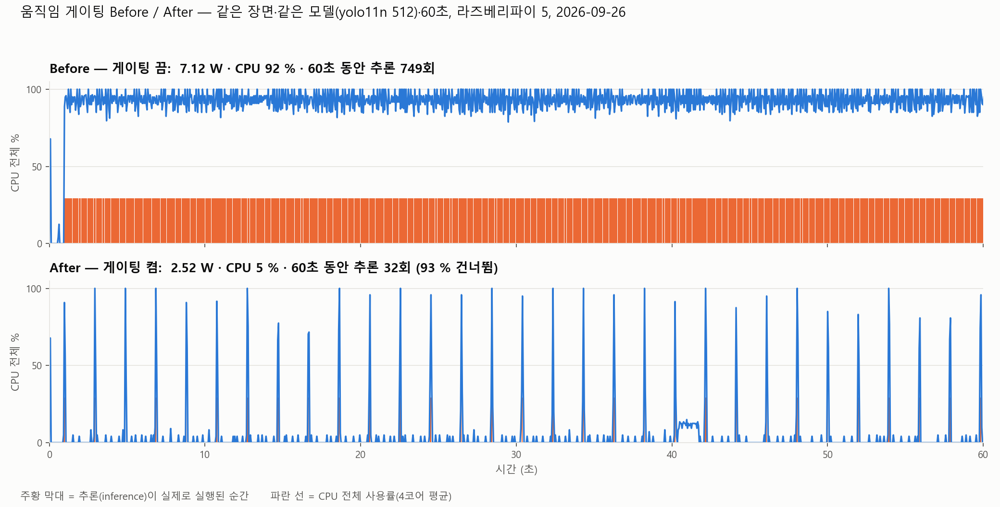
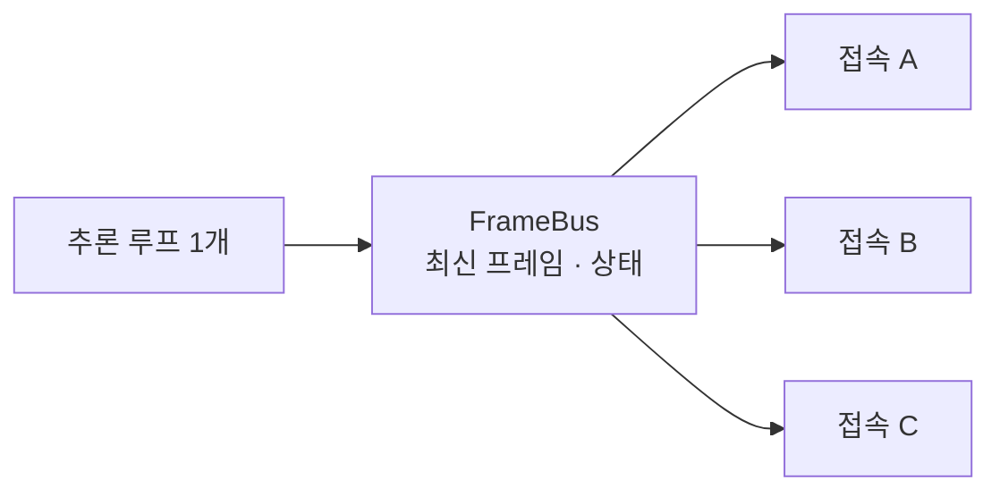

# 온디바이스 AI 기반 위험구역 침입 감지 시스템

> **아기가 칼·콘센트의 위험 반경 안에 0.5초 이상 머물면, 라즈베리파이 5 한 대가 스스로 판단해 부모 휴대폰으로 알린다.**
> 서버 없이 보드 안에서 추론·판정·알림을 끝내고, 평상시 영상은 밖으로 나가지 않는다.

**Team 10** · 강지연 · 정안성 · 정보윤 · 정준혁

| 담당 | 파트 |
|:---|:---|
| 강지연 | 주제 및 결과 요약 · 개발 목표와 결과 · 데이터셋과 학습 |
| 정안성 | 모델 선정 · 3상태 전력 관리 · 향후 연구 과제 |
| 정보윤 | 알림 파이프라인 · 저전력 게이팅 · 결과 분석 및 기대 효과 |
| 정준혁 | 웹 대시보드 · 프로젝트 수행 후기 |

---

## 목차

1. [주제 및 결과 요약](#1-주제-및-결과-요약)
2. [개발 목표 및 개발 결과](#2-개발-목표-및-개발-결과)
3. 핵심 기술
   - [3-1 데이터셋 · 학습](#3-1-데이터셋--학습)
   - [3-2 모델 선정 · 3상태 전력 관리](#3-2-모델-선정--3상태-전력-관리)
   - [3-3 알림 파이프라인 · 저전력 게이팅](#3-3-알림-파이프라인--저전력-게이팅)
   - [3-4 웹 대시보드](#3-4-웹-대시보드)
4. [결과 분석 및 기대 효과](#4-결과-분석-및-기대-효과)
5. [향후 연구 과제](#5-향후-연구-과제)
6. [프로젝트 수행 후기](#6-프로젝트-수행-후기)

---

## 1. 주제 및 결과 요약

**결론** — 4클래스 검출(mAP50-95 0.82)과 관계·체류 판정으로 경보를 만들고, 게이팅과 3상태 전환으로 평상시 전력을 **7.1 W → 1.7~2.5 W**로 낮췄다.

| 항목 | 결과 |
|:---|:---|
| 검출 성능 | YOLO11n 320 입력, mAP50 **0.979** · mAP50-95 **0.818** (시험 사진 227장) |
| 판정 방식 | 아기와 위험물의 **거리 + 0.5초 체류**로 경보 (어른·순간 깜빡임에는 울리지 않음) |
| 평상시 전력 | 게이팅 끔 **7.12 W** → 켬 **2.52 W** (−65 %) · 3상태 대기 **1.7~1.8 W** |
| 알림 | 경보 → LED·소리 → 휴대폰 사진 알림 → 탭하면 실시간 화면 |
| 하루 전력 (빈 방 기준) | **171 → 60 → 42 Wh** (게이팅 끔 → 켬 → 3상태+클럭 조정) |

> 전력은 모두 라즈베리파이 5 PMIC(`vcgencmd pmic_read_adc`) 실측값이며 USB 웹캠 전력은 포함되지 않는다.

---

## 2. 개발 목표 및 개발 결과

**결론** — 목표 4개 중 2개 달성, 2개 부분 달성 (수치 미측정 항목 남음)

| 항목 | 목표 | 결과 | 판정 |
|:---|:---|:---|:---:|
| 위험 판정 | 아기가 위험물 반경 안에 0.5초 머물면 경보 | mAP50-95 0.82 · 시연 거리 칼 검출 640 입력 100 % / 320 입력 0 % | ○ 달성 (640 기준) |
| 오경보 억제 | 어른·순간 깜빡임에 울리지 않음 | 체류 60 % 판정 + 어른 제외 동작 확인 · 시간당 헛알림 수 미측정 | △ 부분 |
| 저전력 | 평상시 추론 최소화 | 게이팅 7.12 → 2.52 W · 3상태 평상시 1.6~1.8 W | ○ 달성 |
| 알림 | 휴대폰 알림 + 실시간 화면 | ntfy 사진·클립·터널 웹 화면 동작 확인 · 도착 지연 미측정 | △ 부분 |

### 시스템 구성

### 시중 제품과의 차이 — "무엇이 있나"가 아니라 "무엇과 무엇의 관계가 위험한가"

| | 일반 홈캠 | AI 홈캠 | **본 시스템** |
|:---|:---|:---|:---|
| 판정 | 모션 감지 | AI 사람 판별 | AI 4클래스 검출 + **관계 · 체류 판정** |
| 알림 내용 | "움직임 감지" | "사람이 있습니다" | "**아기가 칼 반경 안에 0.5초 이상**" |
| 헛알람 | 커튼·햇빛에도 발생 | 사람이면 발생 | 아기가 있어도 **위험하지 않으면 발생하지 않음** |

> 시연 영상: *(발표 자료 PPT 안에 삽입 — 경보 → 휴대폰 알림 → 탭 → 실시간 화면)*

---

## 3. 핵심 기술

### 3-1 데이터셋 · 학습

**결론** — 4명이 나눠 찍고 라벨링한 **1,338장**으로 COCO 사전학습 YOLO를 4클래스로 전이학습했다.

#### 데이터 수집 흐름

| 단계 | 방법 | 이유 |
|:---|:---|:---|
| 촬영 | 키 하나로 상황(아기·칼·근접 등)과 조건(각도·자세·거리·조명)을 **파일 이름에 기록** | 나중에 조건별 검출률을 따로 볼 수 있게 |
| 자동 라벨 | 학습된 모델로 박스 초안을 만들고 사람이 고침 (문턱값 0.25) | 쉬운 박스는 채워 두고, 모델이 못 찾는 **기울어진 · 먼 칼**에 사람 시간을 씀 |
| 분할 | 무작위가 아니라 **촬영 순서 덩어리째** train / test로 나눔 | 0.8초 간격으로 찍은 거의 같은 사진이 양쪽에 들어가 점수가 부풀지 않게 |

#### 데이터 구성

| 구분 | 사진 수 | baby | adult | knife | outlet |
|:---|---:|---:|---:|---:|---:|
| train | 1,111장 | 290 | 446 | 405 | 368 |
| test | 227장 | 53 | 80 | 64 | 60 |

#### 학습 설정

| 항목 | 값 |
|:---|:---|
| 환경 | Google Colab (GPU) · Ultralytics 8.4.98 |
| 시작 가중치 | COCO로 사전학습된 `yolo11n.pt` → 4클래스(baby · adult · knife · outlet)로 파인튜닝 |
| 입력 크기 | 320 × 320 (라즈베리파이 속도 고려) |
| epoch | 120 (60~120 비교 후 선정) |
| 증강 | 회전 ±10° (10~30° 비교 후 선정) · 상하·좌우 반전 · 모자이크 |
| 배포 형식 | `.tflite` FP32 / INT8 → 보드에서 LiteRT로 실행 |

> epoch · 회전 각도 선정 실험과 과적합 확인은 [모델 선정 상세 기록](docs/모델선정_상세.md#4-모델-선정)에 있다.

---

### 3-2 모델 선정 · 3상태 전력 관리

**결론** — 대기는 "아기가 있나"만 보면 되므로 찾기(mAP50) 1위 **SSDLite**, 고성능은 칼·콘센트까지의 거리를 재야 하므로 위치 정확도(mAP50-95) 상위 **YOLO11n**. 상태를 대기 · 감시 · 경보 3개로 나눠 필요할 때만 전력을 쓴다.

#### 5개 경량 모델 비교 — 같은 데이터 · 같은 조건 (epoch 120, 320 입력, `.tflite` FP32)

| 모델 | 특징 | mAP50 (찾기) | mAP50-95 (위치) | 전력 (보드) |
|:---|:---|---:|---:|---:|
| YOLO11n | 기준 모델 · 어텐션 블록 | 0.979 | 0.818 | 실측 예정 |
| YOLO26n | 2026 최신 · NMS 없음 | 0.972 | 0.811 | 실측 예정 |
| YOLOv8n | 가장 널리 쓰임 · 단순 구조 | 0.977 | 0.817 | 실측 예정 |
| YOLOv10n | NMS 없음 · 파라미터 최소 | 0.977 | **0.819** | 실측 예정 |
| SSDLite-MBv3 | 스마트폰용 MobileNetV3 + SSD | **0.984** | 0.758 | 실측 예정 |

- 찾기(mAP50)는 5개 모두 0.97 이상 → 대기 모드에는 어느 모델이든 충분
- 위치 정확도(mAP50-95)는 YOLO 4개가 사실상 동점(차이 0.008), **SSDLite만 −0.06**
- 가장 어려운 클래스 knife의 위치 정확도: **YOLO11n 0.748 vs SSDLite 0.645** → 고성능 모드에는 YOLO11n
- 모델별 소비 전력(FP32 · INT8)은 라즈베리파이 5에서 LiteRT로 실측 중이며, 결과가 나오면 표와 선정을 갱신한다

| 모드 | 선정 기준 | 선정 모델 | 근거 |
|:---|:---|:---|:---|
| **대기** | mAP50 ↑ · 소비 전력 ↓ | **SSDLite-MBv3** | mAP50 1위 (0.984) |
| **고성능** | mAP50-95 ↑ · 소비 전력 | **YOLO11n** | mAP50-95 0.818 (1위와 0.001 차) · knife AP50-95 1위 (0.748) · 기존 코드 호환 |

#### 3상태 전력 관리 — 대기 · 감시 · 경보

| 상태 | 조건 | 모델 · 추론 | 평균 전력 |
|:---|:---|:---|---:|
| 대기 | 아기 없음 | SSDLite · 5초에 1장 | **1.8 W** |
| 감시 | 아기 있음 · 위험 아님 | YOLO11n + 움직임 게이팅 · 최대 10 FPS | **1.7 ~ 2.8 W** |
| 경보 | 아기가 위험 반경 안 | YOLO11n 매 프레임 · 알림 · LED | **6.8 W** (줄이지 않음) |

처음 만든 두 모드(대기 ↔ 고성능) 판은 **아기만 있는 장면**에서 대기와 고성능을 계속 오갔다. 3상태 판은 감시 상태를 추가해 이 왕복을 없앴다.

| 장면 (60초) | 두 모드 판 | 3상태 판 |
|:---|---:|---:|
| 빈 방 | 1.82 W | 1.92 W |
| 아기 가만히 | 4.21 W (왕복 6회) | **1.73 W (−59 %)** |
| 아기 움직임 | 4.29 W (왕복 7회) | **2.76 W (−36 %)** |
| 아기+칼 20초 → 빈 방 40초 | 3.23 W | 2.82 W |
| 아기+칼 계속 (경보) | 6.65 W | 6.14 W |

> 측정: 라즈베리파이 5 PMIC · LiteRT 2.2 · 2026-09-26. 빈 방만 실제 카메라, 나머지는 경보 클립으로 만든 영상 입력(근사치). 고성능 모드만 계속 켜면 7.17 W.
> 모델 선정 과정 전체(용어 · 학습 조건 실험 · 속도 비교 · INT8 트러블슈팅 · 한계)는 **[모델 선정 상세 기록](docs/모델선정_상세.md)** 참고.

---

### 3-3 알림 파이프라인 · 저전력 게이팅

**결론** — 위험 판정 → LED·소리 → 휴대폰 사진 알림 → 탭하면 실시간 화면. 화면이 안 변하면 추론을 건너뛰어 **7.12 → 2.52 W (−65 %)**. 위험 중에는 절대 건너뛰지 않는다.

#### 알림 파이프라인

| 설정 | 값 | 의미 |
|:---|:---|:---|
| 체류 판정 | 0.5초 · 60 % · 최소 3장 | 최근 0.5초 중 60 % 이상이 위험이어야 경보 (순간 오검출 무시) |
| 알림 간격 | 30초 | 같은 경보의 휴대폰 알림 최소 간격 (LED · 소리는 매번) |
| 경보 클립 | 앞 3초 + 뒤 2초 | 보드에 최근 50개만 보관 |

#### 움직임 게이팅 — 화면이 안 변하면 추론을 건너뛴다

1. 새 프레임을 160×120 흑백으로 줄여 **직전 프레임과의 변한 픽셀 비율**만 계산 (약 1 ms)
2. 변한 픽셀 **< 0.6 %** 이고 위험 중이 아니면 → 추론을 건너뛰고 직전 결과를 재사용
3. 안전장치: ① 위험 중에는 절대 건너뛰지 않음 ② 연속 15장 건너뛰면 강제로 한 번 추론 ③ 조용할 때도 8 FPS로 확인 (최대 공백 0.13초)

| 항목 | 게이팅 끔 | 게이팅 켬 |
|:---|---:|---:|
| 평균 전력 | 7.12 W | **2.52 W (−65 %)** |
| CPU 사용률 | 92 % | **5 %** |
| 추론 횟수 / 60초 | 749회 | **32회 (93 % 건너뜀)** |

> 다른 보드 · 다른 장면에서도 재현 (교육장 보드 9/23, 인형·칼 정지 장면): **6.03 → 2.26 W (−62 %)**, CPU 91 → 7~16 %, 보드 온도 57.9 → 45.8 ℃

---

### 3-4 웹 대시보드

**결론** — 추론 루프는 하나만 돌고, 접속자는 그 결과를 **읽기만** 한다. 몇 명이 접속해도 추론은 한 번이고, 아무도 안 봐도 감시는 계속된다. 보드 4대를 한 화면에서 볼 수 있다.

#### 구조 — "보는 사람이 있을 때만 감시"하던 문제를 뒤집었다

| | 처음 구조 (`app.py`) | 바꾼 구조 (`web.py`) |
|:---|:---|:---|
| 추론 루프 위치 | 브라우저 요청 안 (`generate_frames()`) | 별도 루프 1개 → 최신 프레임을 공유 버퍼(FrameBus)에 넣음 |
| 아무도 안 볼 때 | **감시가 멈춤** (카메라 · 경보 · LED 정지) | 감시 계속 · JPEG 인코딩도 건너뜀 (저전력) |
| 2명 이상 접속 | 루프가 여러 개 → 같은 모델에 동시 추론 → **충돌** | 추론은 한 번, 접속자는 읽기만 |

| 주소 | 내용 |
|:---|:---|
| `/` | 보는 페이지 (상태 · FPS · 경보 · 검출 · 온도) |
| `/video_feed` | MJPEG 실시간 스트림 |
| `/api/status` | 상태 JSON (대시보드용) |
| `/snapshot.jpg` | 지금 한 장 |

#### 팀 통합 대시보드 — 보드 4대를 한 화면에

- 보드마다 영상 + 상태 + 누적 경보 + 검출 목록을 2×2로 배치
- **위험 상태인 보드는 카드 테두리가 빨개져** 네 대 중 어디서 일이 났는지 바로 보임
- 꺼진 보드는 "연결 없음"으로만 표시되고 나머지는 정상 동작
- 교육장처럼 같은 네트워크에서는 IP로, 밖에서는 보드마다 Cloudflare 터널 주소로 연결

| 보안 지점 | 현재 | 상용화하려면 |
|:---|:---|:---|
| 추론 | 보드 안에서 끝 — **아무것도 안 나감** | 그대로 |
| 외부 접속 | 터널 주소 + 접속 암호(공유 비밀) | Cloudflare Access · VPN |
| 휴대폰 알림 | 공개 ntfy.sh (3시간 보관) | ntfy 자체 호스팅 |

> 화면 캡처: *(웹 화면 · 팀 대시보드 캡처 추가 예정)*

---

## 4. 결과 분석 및 기대 효과

**결론** — 하루 전력(빈 방 기준) **171 → 60 → 42 Wh**. 전력보다 "관계 판정"이 핵심 차별점이다.

| 부족한 점 | 원인 | 개선책 |
|:---|:---|:---|
| 데이터 | 아기 + 위험물이 함께 있는 학습 사진 99장뿐 | 동시 장면 · 배경(칼 없는 방) 사진 보강, val / test 분리 |
| 야간 | 일반 웹캠은 빛이 없으면 검출 불가 (야간 사진 없음) | 적외선 LED 카메라 + 야간 사진 학습 |
| 전체 전력 | PMIC 값에 USB 웹캠 몫이 없음 | USB-C 전력계로 어댑터 기준 재측정 |

| 활용 방안 | 내용 |
|:---|:---|
| **가정** | 다른 방에 있어도 휴대폰 알림 → 실시간 화면 → 앞뒤 5초 클립으로 접근 과정 확인. 인터넷이 끊겨도 LED · 소리는 동작 |
| **어린이집 · 놀이방** | 방마다 보드 1대, 원장실 PC 한 화면에 방 4개 (팀 대시보드 구현됨). 같은 네트워크 안에서 동작 |
| **대상 · 장소 확장** | "감지 주체"와 "위험물" 클래스 설정만 바꾸고 재학습 → 노인 낙상 구역, 작업장 위험 설비, 반려동물과 화구 (대상마다 사진 수백 장 필요) |

> 시중 제품은 실제 소비 전력을 공개하지 않거나(어댑터 정격만 공개) 2~2.7 W 수준이라, **전력 우위는 주장하지 않는다.** 차별점은 위험물을 스스로 찾고 아기와의 관계로 판정하며, 영상이 밖으로 나가지 않고 구독이 없다는 점이다.

---

## 5. 향후 연구 과제

**결론** — 지금 점수는 같은 방 · 같은 소품으로 찍은 시험 사진 기준이다. **새 환경 검증과 실물 전력 측정**이 먼저다.

| # | 과제 | 문제 | 계획 |
|:---:|:---|:---|:---|
| 01 | 새 환경 검증 | 시험 사진도 같은 방 · 조명 (mAP50 ≈ 0.98) | 다른 방 · 조명 · 각도 사진 50~100장으로 재평가 |
| 02 | 데이터 보강 | 아기 + 위험물 함께 찍힌 학습 사진 99장뿐 | 동시 장면 · 천장 설치 각도 사진 추가 |
| 03 | 모델 통일 · INT8 | 보드에서 SSDLite 20 ms vs YOLO11n 23 ms로 차이 작음 | YOLO11n 하나로 통일, 또는 INT8 + LiteRT |
| 04 | 전체 전력 실측 | PMIC는 USB 웹캠 · 5V 전류를 못 잰다 | USB-C 전력계로 어댑터 기준 재측정 |
| 05 | 실제 카메라 재측정 | 아기 장면 전력은 영상 입력 근사치 | 실물 카메라 · 노이즈 조건에서 3상태 · 게이팅 재측정 |
| 06 | 외부망 알림 보안 | 터널 주소 + 접속 암호에 의존 | 인증 강화 · 영상 전송 암호화 |

---

## 6. 프로젝트 수행 후기

**어려웠던 점과 극복 사례**

| 문제 | 원인 | 해결 |
|:---|:---|:---|
| 2 m 거리의 칼을 전혀 못 찾음 (320 입력 0 %) | 15 cm 칼이 320 입력에서 **21픽셀** — 찾을 정보가 없음 | 같은 가중치를 640 입력으로 내보내 **100 %** |
| 카메라가 20 FPS만 나옴 | 카메라 버퍼 1장 → 처리 중 도착한 프레임을 버림 | 버퍼를 3으로 바꿔 **30 FPS** (감시 공백 제거) |
| INT8이 FP32보다 느림 | 구 버전 엔진(tflite-runtime 2.15)이 INT8을 제대로 가속하지 못함 | LiteRT 2.2로 교체 → INT8 **2.3~2.8배** 빨라짐 |
| 웹 화면을 닫으면 감시가 멈춤 | 추론 루프가 브라우저 요청 안에 있었음 | 추론 루프 1개 + 공유 버퍼 구조로 변경 |
| 측정값이 어느 모델 것인지 모름 | 같은 이름(`best_int8.tflite`)의 다른 파일이 보드에서 덮어써짐 | 파일 이름에 **누가 · 언제 학습했는지** 넣는 규칙 |

---

측정 조건 공통: Raspberry Pi 5 · LiteRT 2.2 (XNNPACK, 4스레드) · USB 웹캠 640×480 · 전력은 PMIC(`vcgencmd pmic_read_adc`) 실측, USB 웹캠 전력 제외.
