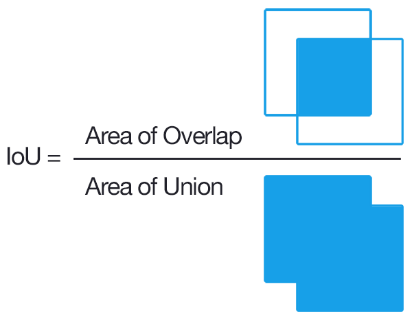
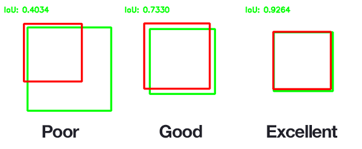
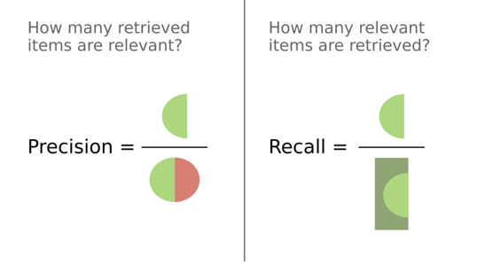
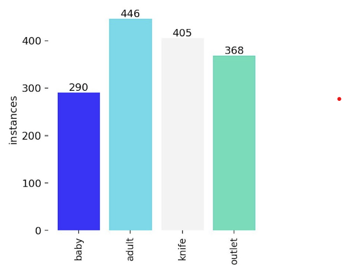
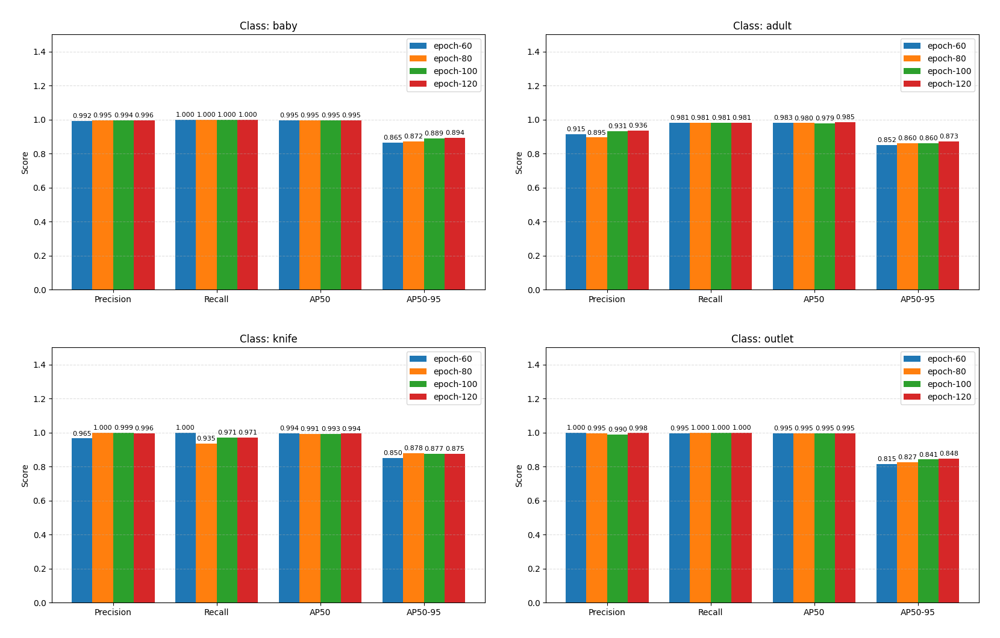
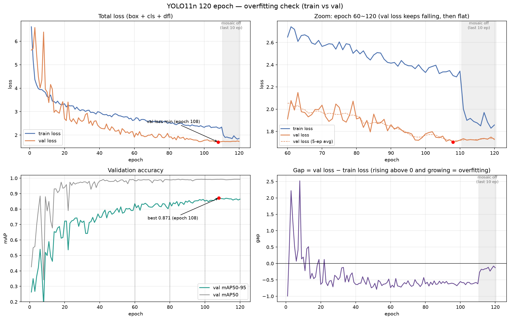
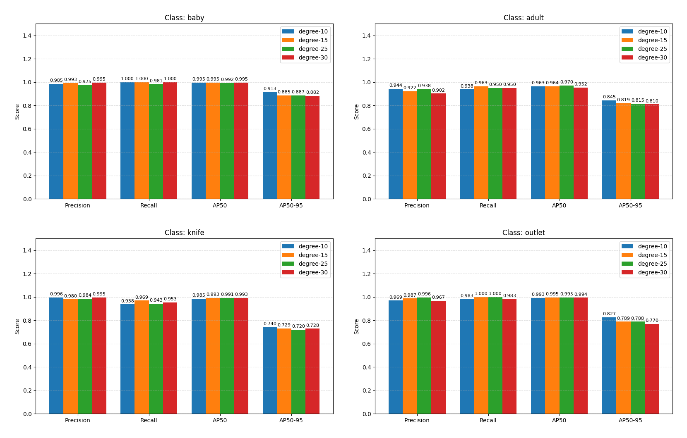
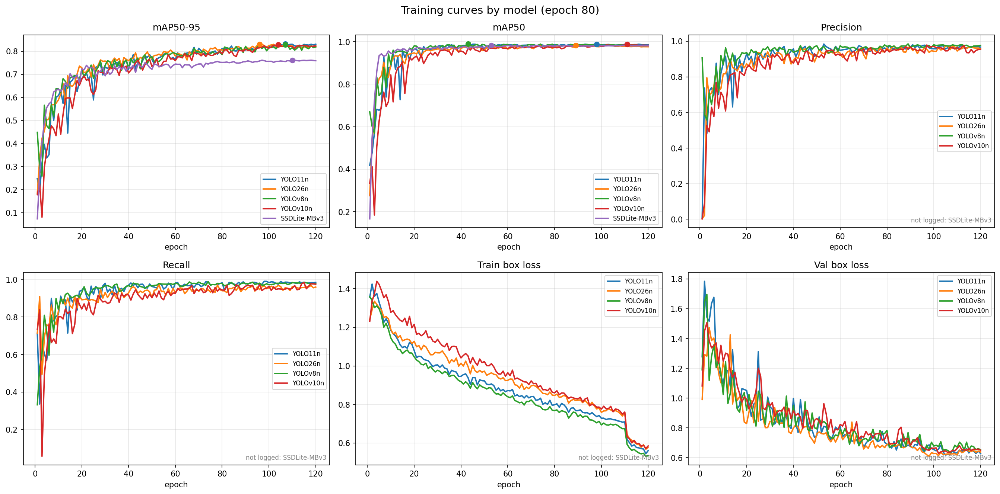
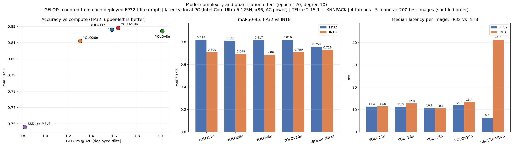
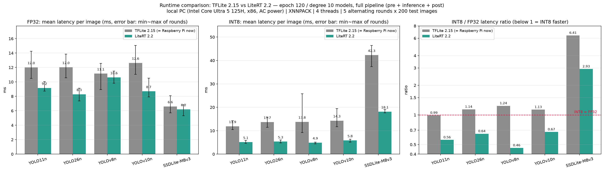

# 모델 선정 상세 기록 — 정안성

> 발표 자료 요약은 [README](../README.md) 참고. 이 문서는 모델 선정 과정(용어, 학습 환경, epoch·degree 실험, 5개 모델 비교, 트러블슈팅, 한계)의 전체 기록이다.


### 1. 구현 목표

```
아기가 위험물(칼, 콘센트) 근처에 가면 부모에게 실시간으로 알리는 저전력 On-device AI 개발을 목표로 한다.
```

+ 아기가 위험물 근처로 가면 **위험 표시**와 함께 부모의 핸드폰으로 실시간 알림이 간다.

+ 저전력 기능 - 대기 모드와 고성능 모드로 구성
```
* 대기 모드 : 카메라 화면에 아기가 없을 때 실행되는 모드

- (CAM 기능) 5초 간격으로 추론한다. 추론 전력을 최소화하는 역할

- (AI 모델) mAP50-95보다 mAP50 성능이 어느 정도 따라오면서, 연산량이 가장 적은 모델이 추론을 담당한다. (현재 후보 SSDLite320)

* 고성능 모드 : 대기 모드에서 아기가 탐지된 순간 실행되는 모드

- (CAM 기능) 연속 추론이 활성화된다. 아기와 위험물이 동시에 포착되면 활성 지속, 아기만 있다면 다시 대기 모드로 들어감.

- (AI 모델) 연산량이 높더라도 mAP50-95 성능이 좋은 모델을 선정한다. (칼을 잘 탐지하기 위해서)
```

### 2. 기본 용어 정리

#### 2-1 IoU — 두 박스가 얼마나 겹치나

**IoU = 겹친 면적 ÷ 합친 면적** (0 ~ 1, 1이면 정답 박스와 완벽히 일치)

<table>
  <tr>
    <td width="50%" align="center"></td>
    <td width="50%" align="center"></td>
  </tr>
  <tr>
    <td align="center">IoU 계산식</td>
    <td align="center">IoU 예시 (빨강: 모델 박스, 초록: 정답 박스)</td>
  </tr>
</table>

+ 아래 AP, Precision, Recall 모두 **"IoU가 기준 이상이면 맞힌 박스(TP)"** 라는 판정 위에서 계산된다.

#### 2-2 Precision, Recall

**Precision은 "헛알림이 적은가", Recall은 "놓치지 않는가"를 잰다.**



| 지표  | 의미 (칼 예시) | 낮으면 생기는 일 |
|:---|:---|:---|
| **Precision** (정밀도) | 모델이 "칼"이라고 한 박스 중 **진짜 칼**의 비율 | 칼이 없는데 알림 → **헛알림** |
| **Recall** (재현율) | 실제 칼 중 모델이 **찾아낸** 칼의 비율 | 칼이 있는데 알림 없음 → **위험을 놓침** |


+ 이 프로젝트에서는 **Recall이 더 중요** (헛알림은 불편하지만, 놓치면 사고로 이어짐)

#### 2-3 AP50, AP50-95

**AP는 한 클래스의 "Precision-Recall 곡선 아래 넓이"이고, 50 / 50-95는 맞힘 판정에 쓰는 IoU 기준이다.** (mAP = 4개 클래스 AP의 평균)

+ 박스 판별 과정
  1. 모델이 사진마다 박스 + 점수(confidence)를 출력
  2. 전체 박스를 **점수가 높은 순**으로 정렬
  3. 박스마다 정답 박스와 IoU 비교 → **IoU ≥ 기준이면 TP, 아니면 FP** (정답 하나에 TP는 하나만, 중복 박스는 FP)
  4. 위에서부터 한 박스씩 내려가며 Precision · Recall을 누적 계산 → **P-R 곡선**
  5. 곡선 아래 넓이 = **AP** (1에 가까울수록 좋음)

| 지표 | IoU 기준 | 측정하는 것 |
|:---|:---|:---|
| **AP50** | 0.5 하나 | 물체를 **찾았나?** (절반만 겹쳐도 정답) |
| **AP50-95** | 0.50, 0.55, …, 0.95 (10개) 각각의 AP 평균 | 박스를 **정확한 위치**에 그렸나? |

+ 예: 위 그림의 Good 박스(IoU 0.73)는
  - AP50 기준에서는 **정답**
  - AP50-95 기준에서는 10개 기준 중 0.50 ~ 0.70 **5개만 정답**, 0.75 ~ 0.95 5개는 오답 → 점수 절반

<sub>그림 출처: Wikimedia Commons — IoU 그림 Adrian Rosebrock, Precision/Recall 그림 Walber (CC BY-SA 4.0)</sub>


### 3. 학습 환경

+ 학습 데이터

| 구분 | 사진 수 | baby | adult | knife | outlet |
|:---|---:|---:|---:|---:|---:|
| train | 1,111장 | 290 | 446 | 405 | 368 |
| test | 227장 | 53 | 80 | 64 | 60 |



+ 왜 이렇게 구성했나?
  - **클래스 개수를 맞추는 것보다, 모델이 헷갈릴 상황을 넣는 것이 목적이다.**
  - **adult가 가장 많은 이유** → 아기와 어른은 모양이 비슷해 가장 헷갈리는 쌍이다. 어른을 아기로 착각하면 헛알림이 나므로 "아기가 아닌 사람" 예시가 많이 필요하다.
    - 어른 사진은 쓸데없지 않다: adult는 사진이 가장 많은데도 AP50이 **4개 클래스 중 가장 낮다** (0.91 ~ 0.95)
    - 어른+칼 사진(55장)은 "어른이 칼을 쓰는 건 정상 상황"을 배우는 데 필요
  - **knife가 가장 많아야 하지 않나?** → 칼의 약점은 개수가 아니라 **박스 위치**다.
    - knife AP50은 이미 0.98 이상 ("찾기"는 충분), 약한 것은 AP50-95 (0.74 ~ 0.75)
    - 칼은 가늘고 길어서 각도에 따라 박스 모양이 크게 바뀜 → 개수보다 **다양한 각도 · 크기 · 손에 쥔 모습**이 필요
  - 개선할 점
    - 실제 알림 상황인 **아기 + 위험물이 같이 찍힌 사진이 적다** (train 99장, test 5장)
    - 다음 수집 때는 어른 사진을 늘리기보다 **아기 + 칼/콘센트 장면과 다양한 각도의 칼**을 보강

+ 학습 환경

| 항목 | 값 |
|:---|:---|
| 환경 | Google Colab (GPU) |
| 라이브러리 | Ultralytics 8.4.98 |
| 시작 가중치 | COCO로 사전학습된 yolo11n.pt (전이학습) |

+ 학습 옵션

```bash
yolo detect train model=yolo11n.pt data={DATA} \
  imgsz=320 epochs=120 batch=32 device=0 workers=4 \
  project={project_root} degrees=10.0 flipud=0.5 \
  fliplr=0.5 mosaic=1.0 name=rps_yolo11n
```

| 옵션 | 의미 | 설명 |
|:---|:---|:---|
| `imgsz=320` | 입력 크기 | 320×320으로 줄여서 학습 (기본 640의 절반, 라즈베리파이 속도 고려) |
| `epochs=120` | 학습 반복 횟수 | train 사진 전체를 120번 반복 학습 (4-1 Step 1에서 선정) |
| `batch=32` | 한 번에 보는 사진 수 | 32장마다 가중치 갱신 → 1 epoch에 약 35번 갱신 |
| `device=0` | 학습 장치 | 0번 GPU 사용 (Colab GPU) |
| `workers=4` | 데이터 로딩 프로세스 수 | 사진 읽기 · 증강을 4개로 병렬 처리 (속도에만 영향, 결과와 무관) |
| `project={project_root}` | 저장 폴더 | 가중치 · 그래프 · results.csv를 Google Drive에 저장 |
| `degrees=10.0` | 회전 증강 | 사진을 ±10° 안에서 무작위 회전 (4-1 Step 2에서 선정) |
| `flipud=0.5` | 상하 반전 | 50% 확률로 위아래 뒤집기 (기본값 0) |
| `fliplr=0.5` | 좌우 반전 | 50% 확률로 좌우 뒤집기 |
| `mosaic=1.0` | 모자이크 증강 | 사진 4장을 한 장으로 붙여 학습, 항상 적용 (**마지막 10 epoch은 자동으로 끔**, 기본값 `close_mosaic=10`) |

+ Best 모델(best.pt)은 어떻게 뽑았나?
  - Ultralytics가 **매 epoch이 끝날 때마다 val 사진으로 자동 평가**
  - 점수(fitness) = **mAP50-95** (Ultralytics 8.4.98 기준)
  - 지금까지 최고 점수보다 높으면 `best.pt`를 덮어쓰고, 마지막 epoch은 `last.pt`로 따로 저장
  - 이번 학습에서는 **epoch 108** (mAP50-95 0.871)이 `best.pt`로 저장 → 이 파일을 .tflite로 변환해 사용
  - 주의: 이 데이터셋은 val과 test가 **같은 227장**이라, test 점수가 실제보다 약간 좋게 나왔을 수 있음


### 4. 모델 선정

#### 4-1 선정 방법

> **Step 1** — epoch별 Precision · Recall · mAP50-95를 비교해 최적 학습 횟수를 판별 (YOLO11n 기준)

+ 클래스별 성능



+ 4개 클래스 평균

| epoch | Precision | Recall | mAP50-95 |
|:---|---:|---:|---:|
| 60 | 0.968 | **0.994** | 0.846 |
| 80 | 0.971 | 0.979 | 0.859 |
| 100 | 0.978 | 0.988 | 0.867 |
| 120 | **0.981** | 0.988 | **0.873** |
| 1위 | **Epoch 120** |**Epoch 60**|**Epoch 120**|

+ 결론
  - **epoch 120**이 평균 mAP50-95 · Precision 모두 1위 (mAP50-95 0.873)
  - Recall은 epoch 60(0.994)보다 **0.006 (0.6%) 낮음** → 사실상 차이 없음
  - epoch이 늘수록 mAP50-95가 꾸준히 오름
  - AP50은 모든 epoch에서 0.98 이상으로 차이 없음 → 차이는 **박스 위치 정확도**에서 발생

+ 과적합 확인
  - epoch 120이 가장 좋게 나왔지만, **"시험 문제를 외워서" 점수가 오른 것인지(과적합)** 반드시 확인해야 함
  - 과적합 판단 기준
    - train loss는 계속 떨어지는데 **val loss가 다시 오르기 시작**
    - **val mAP가 최고점을 찍은 뒤 떨어짐**
    - val loss − train loss 차이(Gap)가 **0보다 커지면서 계속 벌어짐**



+ 판정

| 판단 기준 | 과적합이라면 | 실제 결과 | 판정 |
|:---|:---|:---|:---:|
| val loss | 다시 오른다 | +1.3% (거의 평평) | ✅ 과적합 아님 |
| val mAP50-95 | 최고점 후 계속 떨어진다 | −0.8% (소폭 흔들림) | ✅ 과적합 아님 |
| Gap | 0보다 커지며 벌어진다 | 워밍업(1 ~ 22 epoch) 이후 **항상 음수** (−0.79 ~ −0.08) | ✅ 과적합 아님 |

  - **120 epoch까지 과적합 징후 없음** → val loss가 108 이후 평평해져, 120이 더 학습해도 이득이 없는 **적정 상한**
  - 마지막 10 epoch에서 train loss가 뚝 떨어지고(−19.3%) Gap이 0에 가까워진 것은 **모자이크 증강을 끈 학습 설정** 때문이며 과적합이 아님
  - 최종 가중치(best.pt)는 val 성능이 가장 좋았던 **epoch 108 시점**의 모델

+ → **Best epoch = 120** (과적합 없이 성능 최고)


> **Step 2** — 회전 증강 각도(degree)별 성능을 비교해 최적 각도를 판별 (YOLO11n, epoch 80, 나머지 조건 동일)

+ 클래스별 성능



+ 4개 클래스 평균

| degree | Precision | Recall | mAP50-95 |
|:---|---:|---:|---:|
| 10 | **0.973** | 0.965 | **0.831** |
| 15 | 0.970 | **0.983** | 0.805 |
| 25 | **0.973** | 0.969 | 0.803 |
| 30 | 0.965 | 0.972 | 0.798 |
| 1위 | **Degree 10 · 25** (공동) | **Degree 15** | **Degree 10** |

+ 결론
  - **degree 10이 4개 클래스 모두에서 mAP50-95 1위** (평균 0.831, 2위보다 +0.026)
  - Precision도 평균 공동 1위
  - Recall은 degree 15가 가장 높지만 차이가 작음 (0.983 vs 0.965)
  - 가장 어려운 클래스인 **knife에서도 degree 10이 mAP50-95 1위**
  - → **최적 degree = 10** (박스 위치 정확도가 가장 좋고, 정밀도도 최고 수준)


> **Step 3** — Step 1 · 2에서 고른 Best epoch · Best degree로 5개 모델을 학습
> (YOLO11n / YOLO26n / YOLOv8n / YOLOv10n / SSDLite-MBv3)

| 모델명 | 특징 | 기대효과 |
|:---|:---|:---|
| **YOLO11n** | 기존에 쓰던 기준 모델. 최신 YOLO 구조에 어텐션(주의집중) 블록 포함 | 다른 모델과 비교할 **기준점** |
| **YOLO26n** | 2026년 공개된 최신 YOLO. 엣지 기기용으로 설계, 박스 계산(DFL)과 중복 제거(NMS) 과정을 없앰 | 계산량이 적고 후처리가 가벼워 **속도·전력 모두 유리** |
| **YOLOv8n** | 가장 널리 쓰이는 경량 YOLO. 어텐션 없이 단순한 구조 | 구조가 단순해 추론 엔진과 궁합이 좋고, **정확도 기준 모델** 역할 |
| **YOLOv10n** | 학습 단계에서 중복 박스가 안 나오도록 설계(NMS 불필요). 파라미터 수가 가장 적은 YOLO | 후처리가 없어 **추론 이후 부담이 적음** |
| **SSDLite-MBv3** | YOLO가 아닌 모델. 스마트폰용으로 만든 MobileNetV3 백본 + 가벼운 SSD 헤드 | 계산량이 **5종 중 가장 적어** 저전력에 가장 유리할 것으로 기대 |

\* **n (nano)**: YOLO 모델 크기 중 **가장 작은 버전** (n < s < m < l < x). 파라미터·연산량이 가장 적어 라즈베리파이 같은 소형 기기용

\* **NMS (Non-Maximum Suppression)**: 한 물체에 겹쳐 나온 여러 박스 중 **점수가 가장 높은 박스 하나만 남기는** 후처리 과정. NMS가 없는 모델(YOLO26n, YOLOv10n)은 후처리가 가벼움

\* **어텐션 (Attention)**: 사진 전체에서 **중요한 부분에 더 집중**하도록 가중치를 주는 구조. 멀리 떨어진 물체 사이의 관계(예: 아기와 칼)를 파악하는 데 유리하지만 계산이 추가됨. YOLO11n은 포함, YOLOv8n은 미포함


> **Step 3-1 모델 학습** — 5개 모델을 동일 조건(epoch 120, 회전 증강 ±10°, 같은 데이터셋)으로 학습



+ 해석
  - 5개 모델 모두 **120 epoch까지 안정적으로 수렴**, val loss가 다시 오르는 모델 없음 → **과적합 없음**
  - YOLO 4개는 mAP50-95가 **0.81~0.82로 거의 같은 값**에 수렴, SSDLite는 약 0.76에서 포화
  - mAP50은 5개 모두 **40 epoch 무렵 0.95 이상**에 도달 → "찾기"는 빠르게 학습되고, 이후에는 "위치 정확도"가 오름
  - 110 epoch 부근 train loss 급락은 마지막 10 epoch 동안 **강한 증강(모자이크)을 끄는 학습 설정** 때문
  - SSDLite는 학습 방식이 달라 Precision · Recall · loss 기록 없음 (mAP만 기록)


> **Step 4**
> 1. Colab에서 5개 모델의 클래스별 AP50, AP50-95 순위를 추출
> 2. Local 컴퓨터에서 라즈베리파이와 같은 추론 환경으로 각 모델의 GFLOPs, FPS, mean Latency 도출

+ Local 측정 환경

| 항목 | 값 |
|:---|:---|
| 기기 | 노트북 PC (Intel Core Ultra 5 125H, x86), **전원 연결** |
| 추론 엔진 | **TFLite 2.15 + XNNPACK** (라즈베리파이와 같은 버전) |
| 스레드 | **4개** (라즈베리파이 5 코어 수와 동일) |
| 입력 | 시험 사진 200장, 320×320 |
| 반복 | 5라운드, 라운드마다 모델 순서를 무작위로 섞음 |
| 측정 구간 | 전처리 + 추론 + 후처리(NMS) 전체 |

+ 측정 항목

| 측정 항목 | 의미 | 왜 측정하나 |
|:---|:---|:---|
| **AP50** (Colab) | 박스가 정답과 **절반 이상** 겹치면 정답 → "물체를 **찾았나**?" | **대기 모드** 모델 선정 기준 (아기가 있는지만 확인하면 됨) |
| **AP50-95** (Colab) | 겹침 기준을 50~95%로 점점 엄격하게 올린 평균 → "박스를 **정확한 위치**에 그렸나?" | **고성능 모드** 모델 선정 기준 (아기와 칼·콘센트의 거리 판단) |
| **GFLOPs** | 사진 1장을 처리하는 데 필요한 **계산 횟수** (10억 단위) | 기기와 상관없는 값 → **전력 소모를 예측**하는 기준 |
| **mean Latency** | 사진 1장을 처리하는 **평균 시간** (ms, 전처리 + 추론 + 후처리) | CPU가 일하는 시간 = 전력 소모 → **실제 속도·전력의 직접 지표** |
| **FPS** | 1초에 처리하는 사진 수 (= 1000 ÷ Latency) | 카메라 30fps를 따라잡는지 (**실시간 처리 가능 여부**) |

+ Local에서 Latency를 측정한 이유: Colab은 여러 명이 CPU를 나눠 쓰는 환경이라 노이즈가 커서 측정 오차가 심하다.
  - 예: 같은 SSDLite 모델이 한 번은 16.5 ms(1위), 다른 한 번은 35.7 ms(5위)
+ Latency와 GFLOPs는 라즈베리파이 실측과 다를 수 있으므로 **모델 간 순위 참고용**으로 사용한다.
  - GFLOPs는 학습 파일(.pt)이 아니라 **실제 배포 파일(.tflite)의 연산을 직접 세어** 계산 (학습용 헤드 때문에 .pt 기준 값은 부풀려짐)

**① 클래스별 정확도 (Colab, FP32 tflite, 시험 사진 227장)**

AP50 — "물체를 **찾았나**?"

| 모델 | baby | adult | knife | outlet | 전체 |
|:---|---:|---:|---:|---:|---:|
| YOLO11n | 0.999 | 0.923 | 0.992 | **1.000** | 0.979 |
| YOLO26n | 0.999 | 0.908 | 0.983 | 0.996 | 0.972 |
| YOLOv8n | **1.000** | 0.928 | 0.981 | **1.000** | 0.977 |
| YOLOv10n | 0.990 | 0.938 | 0.992 | 0.989 | 0.977 |
| SSDLite-MBv3 | **1.000** | **0.945** | **0.993** | 0.998 | **0.984** |

AP50-95 — "박스를 **정확한 위치**에 그렸나?"

| 모델 | baby | adult | knife | outlet | 전체 |
|:---|---:|---:|---:|---:|---:|
| YOLO11n | **0.906** | 0.809 | **0.748** | 0.808 | 0.818 |
| YOLO26n | 0.896 | 0.793 | 0.741 | 0.815 | 0.811 |
| YOLOv8n | **0.906** | **0.819** | 0.739 | 0.802 | 0.817 |
| YOLOv10n | 0.894 | 0.818 | 0.746 | **0.820** | **0.819** |
| SSDLite-MBv3 | 0.835 | 0.807 | 0.645 | 0.746 | 0.758 |

**② 연산량 · 속도 (Local, FP32, TFLite 2.15)**

| 모델 | GFLOPs | mean Latency | FPS | YOLO11n 대비 시간 |
|:---|---:|---:|---:|---:|
| YOLO11n | 1.58 | 12.0 ms | 83 | 1.00 |
| YOLO26n | 1.31 | 12.0 ms | 83 | 1.00 ± 0.05 |
| YOLOv8n | 2.02 | 11.1 ms | 90 | 0.93 ± 0.12 |
| YOLOv10n | 1.64 | 12.6 ms | 79 | 1.05 ± 0.06 |
| **SSDLite-MBv3** | **0.82** | **6.6 ms** | **151** | **0.55 ± 0.04** |



> **Step 4-1 모델별 해석**

+ 한눈에 보기

| 항목 | 결과 |
|:---|:---|
| 찾기 (AP50) | 5개 모두 0.97 이상, **SSDLite 1위** (0.984) |
| 위치 정확도 (AP50-95) | **YOLO 4개 사실상 동점** (0.811~0.819), SSDLite만 0.06 낮음 |
| 가장 어려운 클래스 | **knife** — YOLO 0.74~0.75 vs SSDLite 0.645 |
| 속도 | **SSDLite 1위** (YOLO11n의 0.55배), YOLO 4개는 동점 |
| 연산량 vs 속도 | 연산량이 적다고 항상 빠르지 않음 (YOLO26n: 연산량 −17%, 속도 동일) |

+ 모델별 해석

| 모델 | 강점 | 약점 | 판정 |
|:---|:---|:---|:---|
| **YOLO11n** | knife AP50-95 **1위** (0.748), INT8 정확도 공동 1위, 현재 코드 그대로 사용 | 속도는 다른 YOLO와 동점 (이점 없음) | ✅ **고성능 모드 후보** |
| YOLO26n | 연산량 YOLO 중 **최소** (1.31) | 정확도 YOLO 중 최하 (0.811), adult 약함 (0.793), 연산량 이점이 속도로 안 나타남 | ❌ 탈락 |
| YOLOv8n | YOLO 중 속도 약간 빠름 (0.93배, 흔들림 ±0.12) | 연산량 **최대** (2.02), knife YOLO 중 최하, INT8 하락 폭 최대 (−0.131) | ❌ 탈락 |
| YOLOv10n | 전체 AP50-95 1위 (0.819, 2위와 차이 0.001) | YOLO 중 가장 느림 (1.05배), 라즈베리파이 후처리 코드 수정 필요 | ❌ 탈락 (YOLO11n과 동급, 이점 없음) |
| **SSDLite-MBv3** | 찾기(AP50) **1위**, 연산량 **최소** (0.82), 속도 **1위** (0.55배) | 위치 정확도 최하 (0.758), 특히 knife 약함 (0.645) | ✅ **대기 모드 후보** |

  - INT8은 TFLite 2.15에서 빨라지지 않고 정확도만 0.10 안팎 하락 → **FP32 사용** (엔진 문제, 트러블 슈팅 참고)

+ → 이 데이터를 바탕으로 두 모델이 선정 후보로 남았다

| 모드 | 선정 기준 | 후보 모델 | 근거 |
|:---|:---|:---|:---|
| **대기 모드** | mAP50 ↑, 연산량 ↓ | **SSDLite-MBv3** | AP50 1위(0.984), 연산량 최소(0.82), 속도 1위(YOLO11n의 0.55배) |
| **고성능 모드** | mAP50-95 ↑ | **YOLO11n** | knife AP50-95 1위(0.748), 전체 AP50-95 1위와 차이 0.001, 현재 코드 호환 |


> **Step 5 Local에서 측정한 이유와 한계**

+ 왜 라즈베리파이 실측 대신 Local에서 측정했나

| 이유 | 설명 |
|:---|:---|
| **카메라 켠 상태의 전력은 외부 변수가 너무 많음** | 조명·장면에 따라 검출 개수(후처리 부하)가 바뀌고, 카메라 자동 노출·영상 압축 해제 부하, 발열, 배경 작업이 전력에 섞여 **모델 차이만 따로 보기 어려움** |
| 이전 측정에서 이미 오염 사례 발생 | 배경 작업 때문에 유휴 전력 기준값이 1.83 W → 3.50 W로 부풀어, 증가분 데이터를 쓸 수 없었음 |
| 웹캠 전력은 보드 측정에 안 잡힘 | 라즈베리파이 내장 센서(`vcgencmd`)는 보드 내부 전력만 측정, USB 카메라 몫은 별도 측정기 필요 |
| 측정 시간 | 10개 모델(5종 × FP32/INT8) × 반복 측정 × 모델 간 쿨다운 → 주어진 기간 안에 공정하게 측정하기 어려움 |
| Colab은 노이즈가 더 큼 | 여러 명이 CPU를 나눠 써서 같은 모델도 16.5 ms ↔ 35.7 ms로 순위가 뒤바뀜 |

→ **외부 변수를 통제할 수 있는 Local에서, 라즈베리파이와 같은 조건(엔진·스레드)으로 모델 간 순위를 비교**

+ Local 측정의 한계

| 한계 | 영향 | 보완한 방법 |
|:---|:---|:---|
| **CPU 종류가 다름** (x86 vs ARM) | 절대 시간(ms)은 라즈베리파이와 다름, 순위도 바뀔 수 있음 | 결과를 **모델 간 상대 순위**로만 해석 |
| **전력을 직접 재지 않음** | W · mJ 값은 없음 → 처리 시간과 연산량으로 **간접 추정** | 처리 시간(= CPU가 일하는 시간)과 GFLOPs 두 지표를 함께 제시 |
| 카메라 대신 저장된 시험 사진 사용 | 실제 설치 장소의 조명·거리 조건은 반영 안 됨 | 실제 사진 200장으로 후처리 부하는 반영 |
| 노트북 발열 | 긴 측정 중 라운드마다 약 20% 느려짐 | 라운드마다 순서를 섞고 **같은 라운드 안에서 비교** |
| 전원 상태 | 배터리 상태에서는 약 2배 느림 | **전원 연결** 상태에서만 측정 |

+ 라즈베리파이 전력 실측은 최종 후보 2개(SSDLite-MBv3, YOLO11n)에 대해서만 **향후 과제**로 남김


#### 4-2 실제 적용

(4-1)에서 채택된 두 모델을 적용한다.

```
해야 될 것
- 대기 모드와 고성능 모드에서 시간별 전력량을 측정하고 그래프를 도출한다.
- 고성능 모드만 쓸 때 대비 (대기 모드 + 고성능 모드) 평균 전력량을 비교하고 기대효과를 생각해본다 (ex- 24시간 사용 시 얼마나 절약할 수 있는지)
```

### 5. 트러블 슈팅

+ 문제
  - INT8이 FP32보다 **추론 속도는 빠르고 전력은 적을 것**으로 예상했으나, Local과 라즈베리파이 모두에서 **INT8이 더 느리게** 나왔다.

+ 원인 분석
  - 라즈베리파이에서 쓰던 추론 엔진 **TFLite 2.15**(`tflite-runtime`)의 XNNPACK은 Float32 연산에는 최적화되어 있지만, **INT8 연산 처리 방식이 오래된 버전**이라 INT8을 제대로 가속하지 못했다.

+ 해결
  - 추론 엔진을 후속 버전인 **LiteRT 2.2**(`ai-edge-litert`, TFLite의 새 이름)로 바꾸니 성능이 크게 높아졌다.
  - 모델 파일(.tflite)은 그대로, 코드는 import 한 줄만 변경

+ 결과 (Local, 같은 .tflite 파일, 5라운드 교대 측정, mean Latency)

| 모델 | FP32: TFLite 2.15 → LiteRT 2.2 | INT8: TFLite 2.15 → LiteRT 2.2 | LiteRT에서 INT8 / FP32 |
|:---|:---|:---|---:|
| YOLO11n | 12.0 → 9.2 ms (1.31배) | 11.9 → **5.1 ms (2.33배)** | 0.56 |
| YOLO26n | 12.0 → 8.3 ms (1.45배) | 13.7 → **5.3 ms (2.57배)** | 0.64 |
| YOLOv8n | 11.1 → 10.6 ms (1.05배) | 13.8 → **4.9 ms (2.81배)** | 0.46 |
| YOLOv10n | 12.6 → 8.7 ms (1.45배) | 14.3 → **5.8 ms (2.45배)** | 0.67 |
| SSDLite-MBv3 | 6.6 → 6.2 ms (1.06배) | 42.3 → 18.1 ms (2.33배) | 2.93 |



  - 엔진만 바꿔도 **INT8이 2.3~2.8배 빨라짐**, FP32도 1.05~1.45배 빨라짐
  - LiteRT에서는 **YOLO 4개 모두 INT8이 FP32보다 빠름** (FP32 시간의 0.46~0.67배)
  - 단, **SSDLite INT8은 예외** (LiteRT에서도 FP32보다 2.9배 느림, 입력까지 int8로 바뀐 변환 방식이 원인으로 추정)
  - 라즈베리파이(ARM)에서도 같은 효과가 나는지는 실측으로 확인 필요
